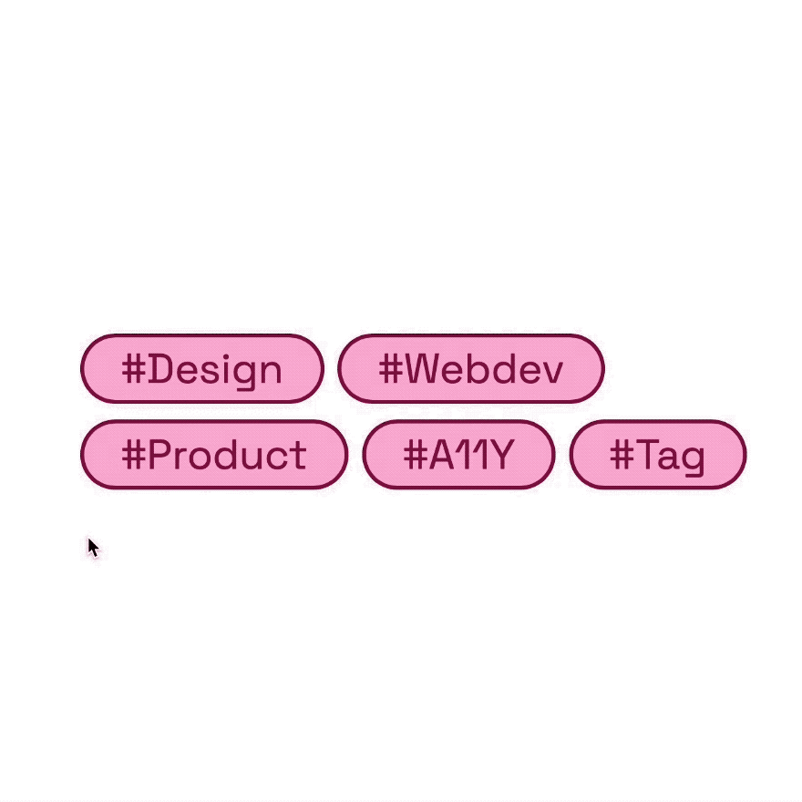
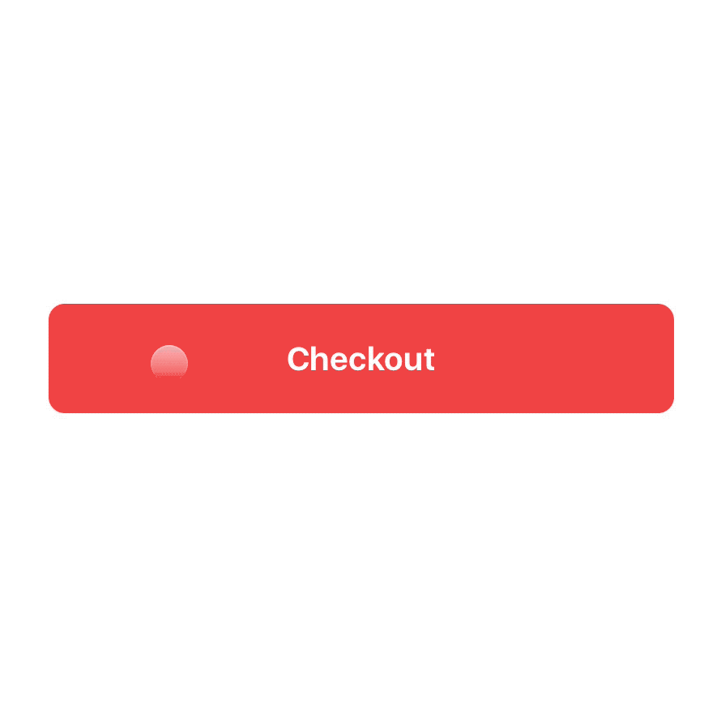

This assignment explores motion and creating micro-interactions in Figma with their prototyping tools. Recreate the 2 motion details below, the hover effect of a tag and the checkout button. Think about the use of components and consistent layer names to best create your interactions.

And design and animate 2 of your own micro-interactions! Think about what role the motion plays in the larger design. Write a short description about how your micro-interactions fit into the main user experience referring to one of the ["Purposes of UI Animation"](https://www.nngroup.com/articles/animation-purpose-ux/) from Nielsen Norman. Don't forget you can always look for inspiration through the software you use and sites like [Dribbble](https://dribbble.com/shots/popular/animation).

  

    
  

  

    
  

Document this assignment in Figma make sure there is a frame clearly labeled with the final interactions.

## Grading Rubric

This assignment will account for 60 points. 15 points per micro-interaction considering the execution of the final interaction and the context of your own design in the greater experience.

### Recreation

| | Execution |
| --- | ----------- |
| | 15 points |
| 100% | Smooth animation, and very closely mimics that of the references |
| 0% | No Evidence |

### Your Design

| | Execution | Description + Context |
| --- | ----------- | ---- |
| | 10 points | 5 points |
| 100% | Realistic and informed design expressing a value add to the overall experience for the user explained in the description | Clear description showcasing the context of the interaction and referencing the "Purpose of UI Animation" |
| 0% | No Evidence | No Evidence |